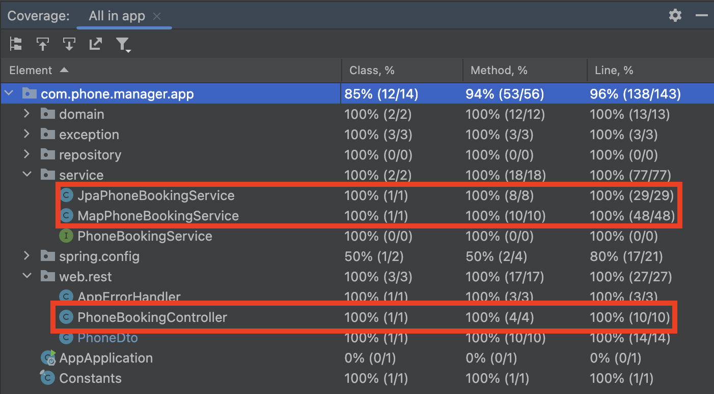

# :phone: Phone Booking Application

## Requirements

Let’s highlight the functional and non-functional requirements of the Phone Booking Application.

### Functional requirements
These are the functionalities a user must be able to perform:

- **Viewing**: The application should allow a user to see the list of available phones and provide the following information:
is the phone available for testing purpose? When was it booked if not available? And who booked it?
- **Booking**: The application should allowed to book a phone that is not already booked
- **Returning**: The application should allowed to return a phone that has been booked by the user who booked it

### Non-functional requirements

- **Consistency**: The application should keep consistent information about the phones. For instance if someone is trying to 
book or return a phone while someone else is viewing the list of phones, he should not see the phone being booked or 
returned in a transient state. The information should be accurate.
In addition, the application should prevent a phone from being booked multiple times by different users. The book and return 
operation should be "atomic".  
- **Security**: while this is not indicated in the description of the exercise, the information about who booked a phone might
not have to be granted to everyone but only to a subset of users such as admins or super-admins.

## Code overview

The interface `PhoneBookService` describes the contract for storing and managing phone entities. Two implementations are 
available: `MapPhoneBookingService` and `JpaPhoneBookingService` with their pros and cons. Those points are discussed below.

The project is a SpringBoot application using Spring Data JPA to provide an implementation of `PhoneBookService` that relies 
on database as storage mechanism, whether it be a relational database or a NoSQL database. In the present case and by convenience,
H2 database is used, but it is easily replaceable with a production-ready database. 

Before going into details, please find a UML diagram of the main classes of this project.


## MapPhoneBookingService

A simple in-memory implementation of `PhoneBookingService` backed by a `ConcurrentHashMap`.

- **Pros**: simple (easy to debug and test), lightweight (no external dependency needed, it's provided by the JDK !),
thread safeness without any effort while avoiding contention, fast (in-memory), easy to deploy
- **Cons**: **not scalable** as only one instance of the application could be deployed. Information not persisted; if
the service is restarted, stored information is lost (in-memory)

## JpaPhoneBookingService

Implementation of `PhoneBookingService` that manages the phone entities via Spring Data JPA Repository. The usage of an 
underlying database and Spring Data JPA framework present several advantages while having some drawbacks.

- **Pros**: storage is persistent, underlying DB can be easily changed, often-needed options such as pagination and auditing
easily accessible, **scalable** because storage and application are decoupled. Usage of optimistic lock via the database, 
which Spring JPA offers with very little effort, prevents concurrent requests to be executed on the same data (e.g. booking same phone
at the same time by multiple users)
- **Cons**: external dependencies are needed, slower than `MapPhoneBookingService` because of DB queries. Deployment, debug,
auditing and testing is more complex

## Testing

Tests can be found in `src/test/java`. Run `mvn test` to run them all. There are 4 main classes to look at.

### Service 

`APhoneBookingServiceTests` is an abstract class that defines all tests to be run with all different implementations of
`PhoneBookService`. 
`JpAPhoneBookingServiceTests` extends `APhoneBookingServiceTests` to test  the `JpAPhoneBookingService` implementation.
`MapPhoneBookingServiceTests` extends `APhoneBookingServiceTests` to test  the `MapPhoneBookingService` implementation.

### Controller

The class `PhoneBookingControllerTests` contains tests related to the REST API. It makes sure that the rest endpoints are 
functional and can respond to http requests coming from http clients. Moreover, it ensures proper HTTP status code 
are returned to the client when a check exception is thrown (See the class `AppErrorHandler`). Such information are valuable
to improve the user experience when building a client application.

The list of check exceptions contains: `PhoneNotAvailableException`, `ReturnPhoneByIncorrectBorrowerException` and `UnknownDeviceException`. 
There are mapped respectively to the following status code: `400` (bad request), `400` and `404` (not found). A message 
is also returned in addition to the status code to give more details about the issue.

## Coverage

Please find a code coverage overview and the full html report [here](https://paulbares.github.io/phone-booking-manager).
It is a best practice to have a good code coverage with **meaningful** tests. 



## Run locally without Docker

### Prerequisites

In order to build and run the server, you will need:
- [Java JDK](https://www.oracle.com/java/) >= 17
- Latest stable [Apache Maven](http://maven.apache.org/)

## Server

- Install prerequisites (see above)
- Launch the project with
```bash
./mvnw spring-boot:run
```

The server is now up and running. Address is: `http://localhost:8080`

## Run locally with Docker

Build the image on your computer by executing the following command in the root directory of the project. It might take 
a few minutes and require internet access as it will download all the necessary dependencies. Name of the image is: `phone-booking-app`
```
docker build -t phone-booking-app -f Dockerfile .
```

Run it in a container, server is started automatically. Port 8080 of the host is mapped to port 8080 of the container. 

- Run First time
```
docker run -it -p 8080:8080 --name phone-booking-app phone-booking-app
```

- Start
```
docker start -a phone-booking-app
```

- Stop
```
docker stop phone-booking-app
```

REST API can be consumed. See CURL section below. 

## CURL 

Once the server is up and running, you can interact with it via curl commands. [Basic authentication](https://developer.mozilla.org/en-US/docs/Web/HTTP/Authentication#basic_authentication_scheme)
is setup to simulate different users. Of course, a different authentication method would need to be used in production.

Available users are `peter` and `paul`. They have the same password: `1234`. 

To retrieve the list of phones as `peter`
```
curl http://localhost:8080/api/phones --user "peter:1234"     
```

To book the phone named `Oneplus 9` as `peter` 
```
curl -X POST http://localhost:8080/api/book -H "Content-Type: application/json" -d 'Oneplus 9' --user "peter:1234"     
```

To return the phone named `Oneplus 9` as `peter` 
```
curl -X POST http://localhost:8080/api/return -H "Content-Type: application/json" -d 'Oneplus 9' --user "peter:1234"     
```

## Demo

Here's a quick video to show the build of the image, the start of the container and few interactions with server via
curl commands (list all phones, book a phone as peter, try to book a phone as paul, return the phone as peter).

https://github.com/paulbares/phone-booking-manager/assets/5783183/7edda6d2-0b7e-4b2e-beb0-3a242c67d50c


