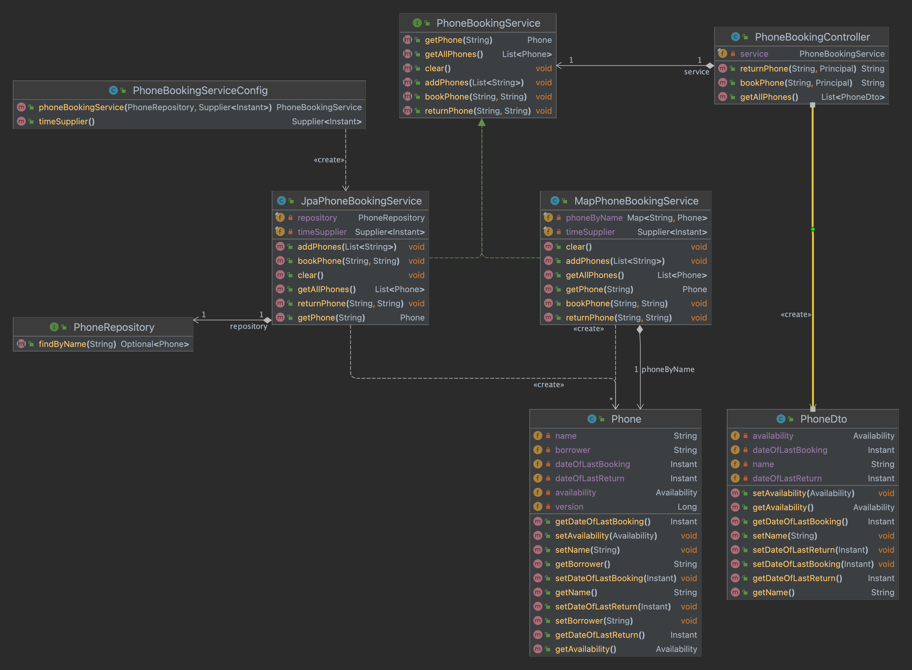

# Phone Booking App

The interface `PhoneBookService` describes the contract for storing and managing phone entities. Two implementations are 
available: `MapPhoneBookingService` and `JpaPhoneBookingService` with their pros and cons. Those points are detailed below.

The project is a SpringBoot application using Spring Data JPA to provide an implementation of `PhoneBookService` that relies 
on database as storage mechanism, whether it be a relational database or a NoSQL database. In the present case and by convenience,
H2 database is used, but it would be easy to replace it with a production-ready database. 

Before going into details, please find a UML diagram of the main classes of this project.



## MapPhoneBookingService

A very simple in-memory implementation of `PhoneBookingService` backed by a `ConcurrentHashMap`.

- **Pros**: simple (easy to debug and test), lightweight (no external dependency needed, it's provided by the JDK !),
thread safeness without any effort and while avoiding contention, fast (in-memory), easy to deploy
- **Cons**: **not scalable** as only one instance of the application could be deployed. If the service is restarted, stored
information is lost (in-memory)

## JpaPhoneBookingService

Implementation of `PhoneBookingService` that manages the phone entities via Spring Data JPA Repository. The usage of an 
underlying database and Spring Data JPA framework present several advantages.

- **Pros**: storage is persistent, underlying DB can be easily changed, often-needed options such as pagination and auditing
easily accessible, **scalable** because storage and application are decoupled. Usage of optimistic lock via the database, 
which Spring JPA offers with very little effort, prevents concurrent requests to be executed on the same data (e.g. booking same phone
at the same time by multiple users)
- **Cons**: external dependencies are needed, slower than `MapPhoneBookingService` because of DB queries, deployment, debug,
auditing and testing is more complex

## Testing

Tests can be found in `src/test/java`. Run `mvn test` to run them. There are 4 main classes to look at.

### Service 

`APhoneBookServiceTests` is an abstract class that defines all tests to be run with all different implementations of
`PhoneBookService`. `JpaPhoneBookServiceTests` extends `APhoneBookServiceTests` and uses an implementation of `PhoneBookService`
that relies on a Spring Data JPA (Java Persistence API).

### Controller

The class `PhoneBookingControllerTests` contains test related to the REST API. It makes sure that the rest endpoints are 
functional and can respond to http request coming from any http client. Moreover, it ensures proper HTTP status code 
are returned to the client when a check exception is thrown (See the class `AppErrorHandler`) 

The list of check exceptions is: `PhoneNotAvailableException`, `ReturnPhoneByIncorrectBorrowerException` and `UnknownDeviceException`. 
There are mapped respectively to the following status code: `400`, `400` and `404`. A message is already returned in addition
to the code.

## Run locally without Docker

### Prerequisites

In order to build and run the server, you will need:
- [Java JDK](https://www.oracle.com/java/) >= 17
- Latest stable [Apache Maven](http://maven.apache.org/)

## Server

- Install prerequisites (see above)
- Launch the project
```bash
./mvnw spring-boot:run
```

Server address is: `http://localhost:8080`

## Run locally with Docker

Build the image on your computer, execute the following command in the root directory of the project. Name of the image is: `phone-booking-app`
```
docker build -t phone-booking-app -f Dockerfile .
```

Run it in a container, it will start automatically the server. Port 8080 of host is mapped to 8080 of container.
```
docker run -it -p 8080:8080 --name phone-booking-app phone-booking-app
```

You can consume the REST API via host. See CURL section below. 

## CURL 

Once the server is up and running, you can interact with it via curl commands. [Basic authentication](https://developer.mozilla.org/en-US/docs/Web/HTTP/Authentication#basic_authentication_scheme)
is setup to simulate different users. Available users are `peter` and `paul`. They have the same password: `1234`. 

To retrieve the list of phones as `peter`
```
curl http://localhost:8080/api/phones --user "peter:1234"     
```

To book the phone named `Oneplus 9` as `peter` 
```
curl -X POST http://localhost:8080/api/book -H "Content-Type: application/json" -d 'Oneplus 9' --user "peter:1234"     
```

To return the phone named `Oneplus 9` as `peter` 
```
curl -X POST http://localhost:8080/api/return -H "Content-Type: application/json" -d 'Oneplus 9' --user "peter:1234"     
```